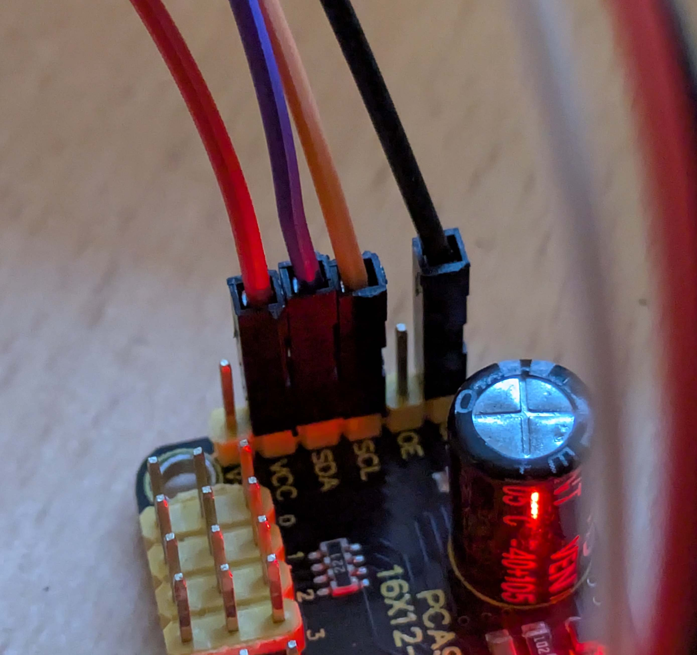

# Motores

para usar el controlador de los servomotores he usado la libreria https://github.com/adafruit/Adafruit_CircuitPython_PCA9685

para hacer las pruebas lo haré en un virtual environment porque python del sistema no me deja instalar librerias con pip.

```bash
sudo apt install python3-dev # dependencia para que compile adafruit

python3 -m venv .venv
source .venv/bin/activate
pip3 install adafruit-circuitpython-pca9685
```

```
pip install RPi.GPIO
pip install adafruit-circuitpython-motor

```

activar i2c para comunicacion

```

sudo raspi-config nonint do_i2c 0
```

https://medium.com/snapp-x/controlling-servos-with-your-flutter-app-on-a-raspberry-pi-using-snapp-cli-a026e88f062f

## Conexiones GPIO


