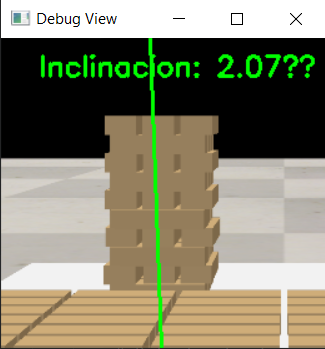
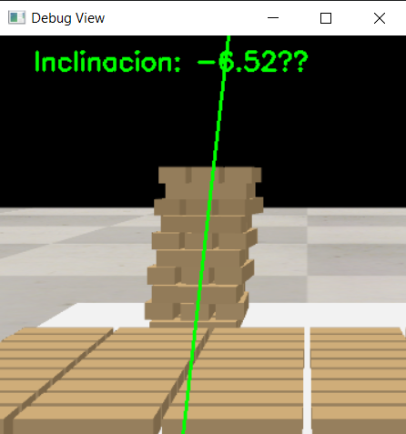

# Modulo de movimiento

## movement

Controla todo el movimiento del robot. Contiene metodos para mover los motores, abrir y cerrar la garra, y mover 
el brazo a la posición deseada (inverse kinematics)

Hay que importar la clase `MovementModuleSim` o `MovementModuleReal` dependiendo de si usamos el robot simulado en
Coppelia o la versión real. 

### Ejemplo 1: Mover brazo a una posición (Inverse Kinematics)

```python
from movement import MovementModuleSim

movement = MovementModuleSim()
movement.reset()
movement.move_arm_to_position(-0.3, 0, 0.10)
```

### Ejemplo 2: Pruebas de motores

```python
from movement import MovementModuleReal

movement = MovementModuleReal()
movement.reset()
movement.move_joint(1,90) # Gira la base 90 grados
movement.move_joint_slow(5,30) # Gira el motor de la pinza 30 grados (lentamente)
```

### Ejemplo 3: Ejecutar construcción de torre

Ejecuta los algoritmos para que el robot construya una torre de jenga con pick and place.

```python
from movement import MovementModuleSim

movement = MovementModuleSim()
movement.reset()
movement.build_tower(9, [0.2, 0.0, 0.105])  # Construye una torre con 9 bloques en esa posición
```

## stability

Algoritmos para comprobar el ángulo de la torre y su estabilidad usando la cámara de Raspberry Pi. Si la desviación es muy grande se detiene la construcción de la torre para evitar caídas.




## place_blocks_test

Pruebas de algoritmo de construcción de torre. De momento los bloques spawnean en el coppelia directamente, en el archivo movement está la versión final del algoritmo integrado
con el resto del módulo de movimiento para que sea el brazo robotico el que haga pick and place.

## coppelia_functions.py

Varias funciones para interactuar con copelia. Lo usa el modulo de movimiento internamente cuando usamos motores reales.
